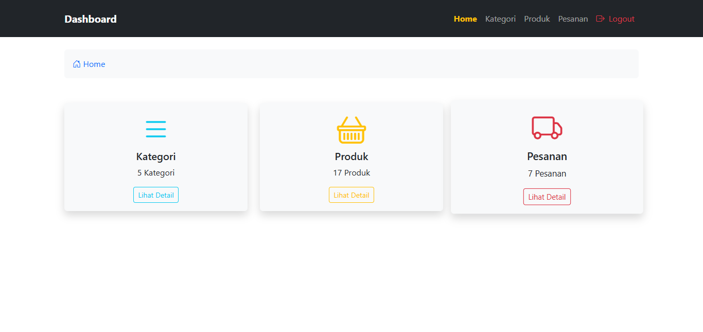
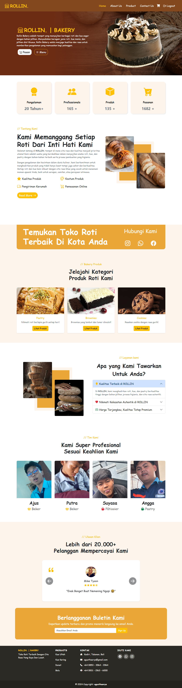

# Website Toko Roti Dinamis

Website Toko Roti Dinamis adalah platform berbasis web yang memungkinkan pengelolaan produk dan pemesanan secara efisien. Website ini memiliki dua peran utama, yaitu **admin** dan **pengunjung**.

## Fitur untuk Admin

- **Manajemen Kategori**  
  Menambahkan, mengedit, dan menghapus kategori produk.  

- **Manajemen Produk**  
  Menambahkan, mengedit, dan menghapus produk roti beserta detailnya seperti harga, deskripsi, dan gambar.  

- **Pemantauan Pesanan**  
  - Melihat daftar pesanan masuk dari pelanggan.  
  - Memeriksa detail pesanan dan status pembayaran.  
  - Mengupdate status pesanan (diproses, dikirim, selesai).  

## Fitur untuk Pengunjung

- **Menjelajahi Produk**  
  Melihat daftar roti yang tersedia beserta harga dan deskripsinya.  

- **Keranjang Belanja**  
  - Memilih produk dan menambahkannya ke dalam keranjang belanja.  
  - Mengubah jumlah atau menghapus produk dalam keranjang sebelum checkout.  

- **Checkout dan Pembayaran**  
  - Melakukan checkout dengan mengisi informasi pengiriman.  
  - Memilih metode pembayaran: **Transfer Bank, E-Wallet, atau Cash on Delivery (COD)**.  

## Teknologi yang Digunakan

- **Backend:** PHP  
- **Database:** MySQL  
- **Frontend:** HTML, JavaScript, dan Bootstrap 5  

Dengan fitur-fitur ini, website Toko Roti Dinamis diharapkan dapat memberikan pengalaman berbelanja yang mudah bagi pelanggan serta mempermudah admin dalam mengelola bisnis secara digital.😆
